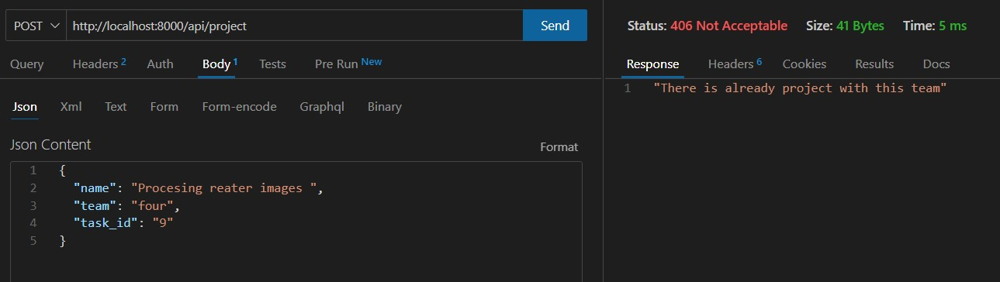

# Тестування працездатності системи

Використовувалося розширення Thunder Client  для Visual Studio Code

## Підключення до серверу

## GET запит всіх сутностей

## GET отримання по id

## POST додавання сутності

### Result

## POST існуючої сутності 

## POST додавання сутності без необхідних даних

## POST з існуючою групою

## PUT оновлення інформації про сущності

### Result

## PUT оновлення інформації по неіснуючому id

## DELETE по існуючому id 

### Result

## DELETE по неіснуючому id

